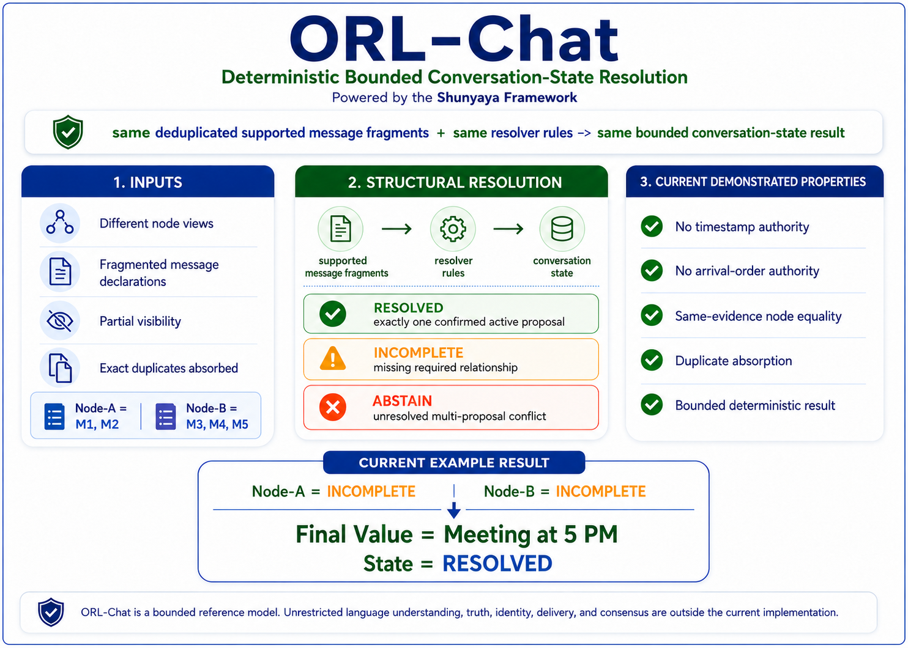

# ⭐ ORL-Chat

**Orderless Chat — Structural Meaning System**

**Deterministic meaning resolution where correctness emerges from structure**

**Structure-Based Meaning Resolution • Open Reference Implementation**

---

**No Time • No Order • No Coordinator**  
**No Timestamps • No Synchronization Required for Meaning**

---

## ⚡ The Shift

**Chat today shows messages.**  
**ORL-Chat shows meaning.**

Same messages.  
Same structure.  
Same meaning.

---

## 🧭 Visual Overview

---

## ⚡ Try it in 30 seconds

Open:

`demo/orl_chat_interactive_demo.html`

Interact with:

- Scramble Arrival  
- Resolve Structure  
- Replay Proof  

Observe:

- same chat fragments produce different visible messages  
- meaning remains unresolved in traditional view  
- deterministic convergence after structural merge  
- identical final meaning across all permutations  

---

## 🔗 Quick Links

### 📘 Docs

- [Quickstart](docs/Quickstart.md)
- [FAQ](docs/FAQ.md)
- [Test Guide](docs/Test-Guide.md)
- [Proof Sketch](docs/Proof-Sketch.md)
- [Structural Overview](docs/ORL-Chat-Structural-Meaning-Overview.png)

---

### ⚡ Demos

- [Python Reference Demo](demo/orl_chat_demo.py)
- [Visual Demo (HTML)](demo/orl_chat_interactive_demo.html)

---

### 🔍 Verification

- [Verify Instructions](VERIFY/VERIFY.txt)
- [Demo Hash Freeze](VERIFY/FREEZE_DEMO_SHA256.txt)

---

### 📂 Repository

- [demo/](demo/) — deterministic structural resolution demos  
- [docs/](docs/) — concepts, proofs, and usage  
- [inputs/](inputs/) — sample chat fragments  
- [outputs/](outputs/) — deterministic resolution outputs  
- [VERIFY/](VERIFY/) — reproducibility and hash verification

---

## ⚡ 30-Second Proof

Step 1:  
Click **Scramble Arrival**  
Same messages → different order → meaning unclear  

Step 2:  
Click **Resolve Structure**  
Same messages → structure applied → meaning resolved  

Final Output:

**Meeting at 5 PM**

Key Observation:

- order changed  
- time irrelevant  
- meaning unchanged  

This is not interpretation.  
This is **structural convergence**.

---

## ⚡ The One-Line Breakthrough

Two independent chat systems receive incomplete, delayed, and out-of-order message fragments — and still arrive at the exact same final meaning.

No ordering guarantees.  
No timing guarantees.  
No synchronization guarantees.  

Yet meaning is guaranteed by **structure**.

---

## ⚡ Structural Invariant

**Same structure → same meaning**

Independent of:

- arrival order  
- timing differences  
- system isolation  

---

## ⚡ Core Truth

Meaning does not come from order.  
Meaning does not come from time.  

**Meaning comes from structure.**

---

## ⚡ Core Identity

`correctness != time + order + sync`  

`meaning = resolve(structure)`

---

## 🧾 Structural Lineage

ORL-Chat extends the structure-first logic of ORL into conversational systems.

It is the domain-level proof that meaning can be resolved structurally — not interpreted manually.

---

## 💡 What ORL-Chat Demonstrates

Conversational correctness does not require:

- timestamps  
- message ordering  
- synchronized systems  
- continuous connectivity  

Instead:

`correctness = structure`

---

## ⚡ Core Structural Model

A conversation is treated as **structure**, not sequence.

Example:

- M1: proposal  
- M2: correction  
- M3: retraction  
- M4: final update  
- M5: confirmation  

Resolution:

`resolve(structure) -> final meaning`

---

## ⚡ Minimal Resolver Definition

Let:

`S = set of message fragments`  
`R = structural rules`

Then:

`meaning = resolve(S, R)`

Resolution outcomes:

- valid → **RESOLVED**  
- missing → **INCOMPLETE**  
- conflicting → **ABSTAIN**  

---

## ⚖️ What ORL-Chat Is / Is Not

### ORL-Chat IS:

- a structural meaning resolution model  
- a deterministic interpretation layer  
- a convergence-based communication model  
- a domain application of ORL  

### ORL-Chat IS NOT:

- a chat application replacement  
- a messaging protocol  
- a UI system  

---

## 🔥 Core Structural Law

- valid → **RESOLVED**  
- missing → **INCOMPLETE**  
- conflicting → **ABSTAIN**

---

## 🛡 Classical Compatibility Guarantee

For valid conversations:

**classical interpretation = ORL-Chat result**

For incomplete or conflicting structure:

- INCOMPLETE → no forced meaning  
- ABSTAIN → no unsafe meaning  

---

## 🧮 Structural Guarantees

- Determinism → same structure → same meaning  
- Order Independence → invariant under permutation  
- Time Independence → no temporal dependency  
- Replay Safety → reproducible outcomes  

---

## 🔁 Replay Guarantee

`same structure -> same meaning`

Even if:

- arrival order changes  
- messages are delayed  
- systems are offline  

---

## 🧭 The Scenario

Two systems:

- Node-A  
- Node-B  

Each sees partial fragments.

After structural merge:

**Meeting at 5 PM**

---

## 🛡 Safety Model

- INCOMPLETE → no conclusion  
- ABSTAIN → no unsafe conclusion  

---

## 🌍 Why This Matters

Traditional systems:

- depend on order  
- require interpretation  
- produce ambiguity  

ORL-Chat:

- resolves meaning deterministically  
- eliminates ambiguity  
- enables safe communication  

---

## ⚡ What This Challenges

Traditional assumption:

meaning = order + time + interpretation  

ORL-Chat shows:

`meaning = structure`

---

## 🧱 Minimal Integration

`input fragments -> resolve(structure) -> final meaning`

---

## 🚀 Open Locally

Open:

`demo/orl_chat_interactive_demo.html`

Or run:

`python demo/orl_chat_demo.py --write-output`

This will:

- execute deterministic structural resolution  
- generate verifiable output  
- reproduce the same final meaning  

Expected result:

**Meeting at 5 PM**

---

## 📊 Comparison

Traditional:

- order dependent  
- user interpretation  

ORL-Chat:

- no order  
- no time  
- deterministic meaning  

---

## ⚡ Minimal Proof Statement

Given:

same message fragments  

Without:

- time  
- order  
- synchronization  

Result:

same final meaning  

---

## 🌍 Real-World Implications

- offline communication  
- distributed collaboration  
- AI interpretation layers  
- multi-agent systems  

---

## 🧭 Adoption Path

**Immediate**

- interpretation layer  
- audit layer  

**Advanced**

- distributed communication systems  

---

## 📜 License

See: [LICENSE](LICENSE)

Reference Implementation:
**Open Standard** — free to use, study, implement, extend, and deploy  

Architecture:
Creative Commons BY-NC 4.0

---

## 🔗 Related Projects

- [ORL](https://github.com/OMPSHUNYAYA/Orderless-Ledger)
- [STOCRS](https://github.com/OMPSHUNYAYA/STOCRS)
- [SSUM-Time](https://github.com/OMPSHUNYAYA/SSUM-Time)

---

## ⚡ Final Truth

Messages arrived in different orders.  
Systems saw different fragments.  
Time was inconsistent.  

Yet meaning was the same.

**Correctness is structure.**
