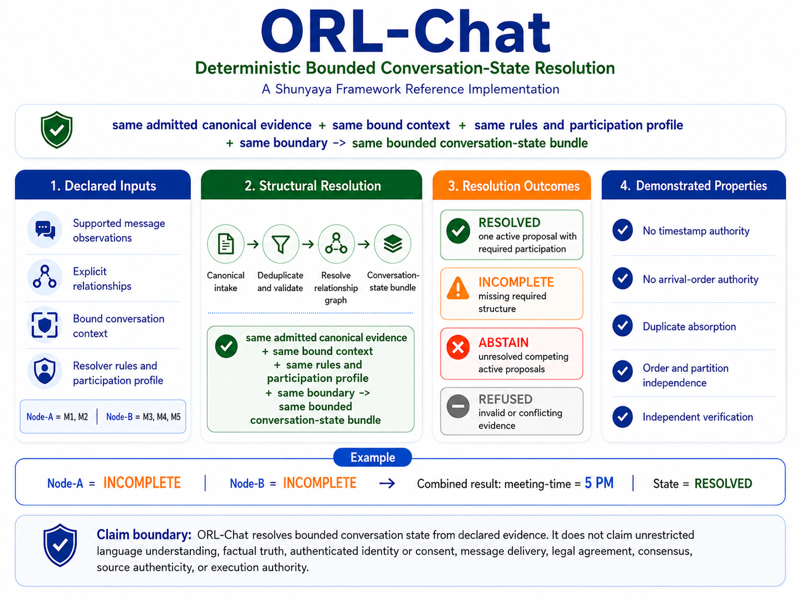

# ORL-Chat v2.0.0

## Deterministic Bounded Conversation-Evidence Reconciliation

ORL-Chat resolves the current declared state of supported proposals, amendments, withdrawals, endorsements, and objections from validated canonical conversation evidence.

Its governing contract is:

`same admitted canonical conversation evidence + same bound conversation context + same ruleset + same text profile + same participation profile + same boundary declaration -> same bounded conversation-state bundle or deterministic refusal`

Message arrival position and wall-clock timestamps are not used as resolution authority within the declared model.

ORL-Chat operates on declared typed structure. It does not infer unrestricted language meaning, authenticate participants, prove factual truth, establish legal agreement, authorize an action, or execute an instruction.

---

## 🧭 Visual Overview



---

## What the Package Provides

- A deterministic Python reference kernel.
- A separately implemented Python verifier that does not import the producer kernel.
- A separately implemented JavaScript resolver.
- Browser laboratories for structural resolution and Conversation-State Capsules.
- Frozen Python and cross-language parity corpora.
- Strict JSON intake with duplicate-key, floating-number, out-of-range-integer, unsupported-field, and resource-bound refusal.
- A runtime-independent exact Unicode scalar-sequence text profile.
- Iterative typed relationship-graph resolution with `MAX_GRAPH_DEPTH = 256`.
- Explicit `RESOLVED`, `INCOMPLETE`, `ABSTAIN`, and pre-resolution `REFUSED` states.
- Participation profiles and declared evidence-boundary states.
- Public receipts and private reconstruction bundles.
- Privacy-separated Conversation-State Capsules.
- Deterministic capsule verification and comparison.
- A live Python-JavaScript cross-implementation checker.
- A reproducible seeded property verifier for generated bounded graphs.
- Hostile-input, falsification, mutation, graph-depth, cycle, privacy, order, partition, duplicate, relay, and tamper assurance.

---

## Quick Start

### Requirements

- Python 3.9 or later.
- Node.js 18 or later for JavaScript verification.
- A modern browser for the laboratories.

### Complete verification

From the `Public_Release` directory, use any one of these commands:

```text
python -B VERIFY_ALL.py
VERIFY_ALL.bat
./verify_all.sh
```

`VERIFY_ALL.py` is the shared cross-platform runner. The Windows and shell files are thin wrappers. Every path stops at the first failing stage and prints:

```text
ORL-Chat v2.0.0 complete verification: PASS
```

when every included verification stage succeeds.

### Open the browser laboratories

For the most consistent browser behavior, start a local HTTP server from the `Public_Release` directory:

```text
python -m http.server 8000
```

Then open:

```text
http://localhost:8000/demo/ORL_Chat_Structural_Lab_v2_0_0.html
http://localhost:8000/demo/ORL_Chat_Capsule_Lab_v2_0_0.html
```

Stop the server with `Ctrl+C`.

The HTML files may also be opened directly, but some browsers display `file:` origin warnings or restrict local resource behavior.

---

## Current Verification Evidence

The included verification reports record the following passing results:

```text
Python reference kernel:                         2955/2955 PASS
Independent Python verifier:                      173/173 PASS
Frozen Python corpus:                               13/13 PASS
Cross-language vector reproducibility:                  PASS
JavaScript resolver and cross-language parity:     442/442 PASS
Live Python-JavaScript bundle cross-check:             17/17 PARITY
Strict-parser Python-JavaScript cross-check:             8/8 PARSER PARITY
Seeded generated-property cases:                       32/32 PASS
Seeded generated-property assertions:                 256/256 PASS
Conversation-State Capsule unit audit:                 14/14 PASS
Adversarial assurance:                                154/154 PASS
Capsule cross-language parity:                        310/310 PASS
Selected-file SHA-256 verification:                        PASS
```

The live Python-JavaScript and seeded-property verifiers decode Node subprocess output explicitly as strict UTF-8, so their behavior does not depend on the Windows active code page.

These results apply only to the declared v2.0.0 schemas, profiles, corpora, limits, implementations, and verification artifacts. Producer audits, parity checks, and separate implementation reconstruction do not constitute independent third-party certification.

---

## Processing Model

`raw JSON -> strict intake and exact-integer admission -> exact text-profile validation -> canonical evidence -> observation identity -> action identity -> exact duplicate absorption -> typed relationship graph -> active proposal frontier -> participation evaluation -> topic receipts -> boundary receipt -> public receipt + private bundle -> Conversation-State Capsule`

The resolver derives state from the admitted canonical graph rather than simulating a chat timeline.

---

## Supported Action Grammar

- `PROPOSE`
- `AMEND`
- `WITHDRAW`
- `ENDORSE`
- `OBJECT`

`PROPOSE` and `AMEND` can produce active proposals. `WITHDRAW` removes a supported target from the active frontier. `ENDORSE` and `OBJECT` contribute declared participation signals.

Presentation text is retained in the private bundle but does not determine action identity or resolution.

---

## Resolution and Refusal States

- `RESOLVED`: exactly one supported active proposal remains and the declared participation profile is satisfied.
- `INCOMPLETE`: valid admitted structure is insufficient for resolution.
- `ABSTAIN`: valid admitted structure contains a bounded disagreement or conflict that prevents a single result.
- `REFUSED`: malformed, unsupported, cross-context, identity-conflicting, or resource-invalid input is rejected before topic resolution.

Strict-JSON intake occurs before a conversation document exists. Parser refusals are surfaced as intake errors and do not carry a bundle identity.

Inputs that pass strict-JSON intake but violate the supported structural contract produce canonical `REFUSED` bundles with deterministic `refusal_id` values.

`strict-parser refusal != canonical REFUSED bundle`

Validation refusal occurs before topic resolution:

`invalid or resource-invalid structure -> REFUSED`

For admitted topic evidence, the reason-code precedence is:

`DEPENDENCY_CYCLE > PARTICIPANT_SIGNAL_CONFLICT > MULTIPLE_ACTIVE_PROPOSALS > MISSING_DEPENDENCY > NO_ACTIVE_PROPOSAL > ACTIVE_PROPOSAL_OBJECTED > participation evaluation`

At the final participation step, the topic becomes `RESOLVED` when the selected profile is satisfied and otherwise becomes `INCOMPLETE / PARTICIPATION_INCOMPLETE`. This precedence prevents a lower-priority condition from masking a higher-priority structural conflict.

---

## Participation Profiles

- `NO_ENDORSEMENT_REQUIRED`
- `SINGLE_DECLARED_ENDORSER`
- `ALL_DECLARED_PARTICIPANTS`
- `EXACT_DECLARED_PARTICIPANT_SET`
- `DECLARED_THRESHOLD`

These profiles evaluate declared evidence. They do not authenticate people or prove consent.

---

## Declared Graph-Depth Bound

ORL-Chat declares:

`MAX_GRAPH_DEPTH = 256`

From any action, the resolver may follow at most 256 dependency edges before reaching a terminal action or a repeated action. A path requiring an additional edge is refused deterministically with:

`action <action_ref>: dependency chain exceeds maximum depth`

`256 dependency edges / 257 actions -> admitted`

`257 dependency edges / 258 actions -> REFUSED`

Cycle discovery and dependency-readiness evaluation use iterative traversal in the Python producer, independent Python verifier, and JavaScript resolver. A supported cycle within the declared bound remains admitted and resolves to `ABSTAIN / DEPENDENCY_CYCLE`; exceeding the graph-depth bound produces `REFUSED` before topic resolution.

---

## Evidence Boundary

- `OPEN`: the observed evidence set is not declared complete.
- `SEALED`: the declared expected observation-reference set exactly matches the observed set.
- A requested sealed boundary can resolve to `INCOMPLETE` or `CONFLICT` when the declared and observed sets do not match.

`SEALED` is a bounded evidence-set statement. It does not prove that no undisclosed message exists elsewhere.

---

## Observation and Action Separation

The same conversational action may be observed through more than one source.

`observation multiplicity != action multiplicity`

Exact duplicate observations are absorbed. Relay observations can preserve distinct observation paths while referring to one canonical action. Conflicting reuse of an observation reference or action reference is refused.

---

## Public Receipt and Private Bundle

The public receipt carries a portable structural summary without raw presentation text or raw declared values.

The private bundle retains admitted observations, presentations, declared values, graph structure, witnesses, and reconstruction material.

Both artifacts declare:

`execution_authority = NONE`

---

## Conversation-State Capsule

A Conversation-State Capsule is a portable privacy-separated state derived from a verified private bundle.

`verified private bundle -> structural identities + committed values + witnesses -> capsule`

A capsule contains state, reason, active-frontier identities, evidence coverage, boundary status, and deterministic value commitments without carrying raw message presentations, raw declared values, participant names, observation sources, or action references.

A value commitment supports deterministic comparison within the declared profile. It is not encryption, and low-entropy values may be guessable by enumeration.

Every capsule declares:

`execution_authority = NONE`

---

## Capsule Comparison

Comparison is directional:

`compare(left, right) -> relation of right to left`

Supported relations:

- `IDENTICAL`: the canonical capsule identities match.
- `COMPATIBLE`: the declared comparison context matches and common topics do not contain divergent resolved-value commitments.
- `SUPERSEDES`: the right action set strictly extends the left and changes the bounded state without resolved-value divergence.
- `DIVERGES`: a common topic resolves to a different declared-value commitment.
- `INCOMPARABLE`: the declared comparison context differs.
- `UNSUPPORTED`: at least one capsule fails structural verification.

These are bounded structural relations. They are not universal semantic, temporal, legal, or consensus relations.

---

## Main Commands

### Resolve the representative scenario

```text
python -B demo/ORL_Chat_Reference_Kernel_v2_0_0.py --scenario corrected-instruction
```

### Independently verify a frozen bundle

```text
python -B verifier/ORL_Chat_Independent_Verifier_v2_0_0.py --verify examples/ORL_Chat_corrected_instruction_Bundle_v2_0_0.json --strict-canonical
```

### Create a capsule

```text
python -B demo/ORL_Chat_Conversation_State_Capsule_v2_0_0.py --create capsules/source_bundles/corrected-resolved_Bundle_v2_0_0.json --strict-canonical --output ORL_Chat_Capsule.json
```

### Verify a capsule

```text
python -B demo/ORL_Chat_Conversation_State_Capsule_v2_0_0.py --verify ORL_Chat_Capsule.json --strict-canonical
```

### Verify a capsule against its source bundle

```text
python -B demo/ORL_Chat_Conversation_State_Capsule_v2_0_0.py --verify ORL_Chat_Capsule.json --bundle capsules/source_bundles/corrected-resolved_Bundle_v2_0_0.json --strict-canonical
```

### Compare two capsules

```text
python -B demo/ORL_Chat_Conversation_State_Capsule_v2_0_0.py --compare capsules/artifacts/base-incomplete_Capsule_v2_0_0.json capsules/artifacts/corrected-resolved_Capsule_v2_0_0.json --strict-canonical
```

Expected relation:

```text
SUPERSEDES
```

### Canonicalize an ordinary strict-JSON document

```text
python -B demo/ORL_Chat_Reference_Kernel_v2_0_0.py --canonicalize input.json --output canonical_input.json
```

This writes the canonical artifact form. It does not by itself establish that the document satisfies the ORL-Chat semantic intake contract.

### Cross-check Python and JavaScript on every shipped input

```text
python -B verifier/ORL_Chat_Cross_Language_Cross_Check_v2_0_0.py --all-examples
```

### Cross-check strict-parser refusal outcomes

```text
python -B verifier/ORL_Chat_Cross_Language_Cross_Check_v2_0_0.py --all-parser-cases
```

Matching parser refusals return exit code `0`. Cross-implementation divergence returns `1`. Tool, path, or runtime failure returns `2`.

### Run the reproducible generated-property verifier

```text
python -B verifier/ORL_Chat_Seeded_Property_Verifier_v2_0_0.py --seed 20260731 --cases 32
```

The verifier uses `ORL-CHAT-SPLITMIX64-2-D01`, so the same seed defines the same generated cases across supported Python runtimes.

---

## Package Structure

```text
Public_Release/
  README.md
  LICENSE
  VERIFY_ALL.py     shared cross-platform verification runner
  VERIFY_ALL.bat    Windows wrapper
  verify_all.sh     Linux and macOS wrapper
  demo/            reference and browser implementations
  verifier/        independent verification, live cross-check, property, and parity tooling
  corpus/          frozen bounded conversation scenarios
  parity/          Python and JavaScript parity vectors
  capsules/        capsule vectors, artifacts, comparisons, inputs, and bundles
  hostile/         strict hostile-input corpus
  falsification/   deliberately altered artifacts
  examples/        representative inputs and bundles
  VERIFY/          public verification reports and representative artifacts
  docs/            architecture, quickstart, FAQ, boundaries, integration, and verification guidance
  hashes/          minimal SHA-256 manifest for selected verification-critical files
```

---

## Documentation

- `docs/Quickstart.md`
- `docs/Architecture.md`
- `docs/Conversation_State_Capsule.md`
- `docs/Integration_Guide.md`
- `docs/Verification_Guide.md`
- `docs/Claim_and_Threat_Boundary.md`
- `docs/FAQ.md`
- `docs/Text_Profile.md`

---

## Canonical Data Contract

The supported data contract includes:

- Strict UTF-8 JSON.
- Duplicate-key refusal.
- Floating-number, `NaN`, and infinity refusal.
- Exact interoperable integer range `-9007199254740991` through `9007199254740991`, enforced during strict-JSON parsing.
- Exact Unicode scalar-sequence preservation without runtime normalization.
- A frozen control, format, and surrogate rejection table.
- Fixed supported field sets.
- Bounded identifiers, text, arrays, objects, values, participants, observations, graph depth, and input bytes.
- Deterministic canonical JSON identities.
- Two-space, sorted-key, LF-terminated canonical artifact files.

---

## Text Profile

ORL-Chat v2.0.0 declares:

`ORL-CHAT-UNICODE-SCALAR-EXACT-2-D01`

Strings are preserved as exact Unicode scalar sequences. The implementation does not use the host runtime's Unicode database to normalize text or classify admitted characters.

- Canonically equivalent sequences remain distinct unless their code points are identical.
- Identifiers refuse a frozen table of control, format, and surrogate code points.
- Presentation text and declared-value strings permit LF and TAB but refuse CR and the remaining frozen control, format, and surrogate code points.
- The same explicit code-point rules are implemented in the Python producer, independent Python verifier, and JavaScript resolver.

`"café" != "cafe\u0301"`

This exact-sequence rule closes runtime Unicode-version drift within the declared text profile. See `docs/Text_Profile.md`.

---

## Hash Scope

The package includes one minimal manifest:

`hashes/SHA256SUMS.txt`

It covers 14 verification-critical files: four core implementation files, six principal verifier files, the shared verification runner, and three corpus or vector-root files. Root files, documentation, browser HTML files, verification reports, examples, hostile fixtures, falsification fixtures, generators, and generated capsule sub-artifacts are intentionally outside this minimal scope.

The manifest supports byte-integrity checking for the selected surface. It does not replace semantic verification, source authentication, or independent review.

---

## Claim Boundary

ORL-Chat is a bounded deterministic conversation-evidence resolver. It does not establish:

- Unrestricted natural-language understanding.
- Factual truth.
- Source authenticity.
- Participant identity.
- Authenticated consent.
- Message delivery or reading.
- Legal agreement.
- Consensus.
- Authorization.
- Execution authority.
- Safety or suitability of an instruction.
- Completeness beyond the declared evidence boundary.
- Production suitability without independent domain validation.
- Semantic equivalence between different Unicode scalar sequences.

A resolved value, verified bundle, or verified capsule does not by itself establish that the value is true, authorized, safe, lawful, current outside the declared evidence, or suitable for execution.

---

## 📜 License

See: [LICENSE](LICENSE)

The ORL-Chat reference implementation and associated verification artifacts are free to use, copy, modify, test, study, and redistribute without a license fee, subject to the license terms stated in the repository.

Documentation, architecture materials, specifications, diagrams, and explanatory content are subject to the separate terms stated in the LICENSE.

This repository does not claim recognition as a formal technical standard, security certification, production qualification, or third-party verification.
